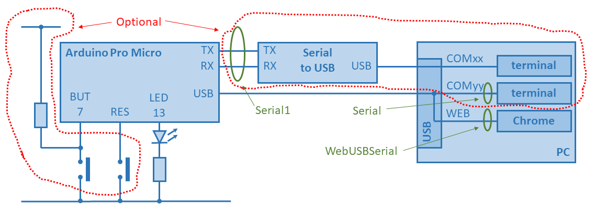

# WebUSB-LED
WebUSB demo: control a LED on a USB stick via a website

## Introduction
This demo explores the WebUSB technology.
This promisses
 * Plug in a USB dongle (which has WebUSB compliant firmware)
 * Chrome suggests a URL to visit (which is published by the dongle)
 * The (javascript on the) webpage loaded from the URL is allowed to communicate with the dongle
 * The webpage demos the features of the dongle
 
This project is a trial of this technology.
It consists of
 * An arduino Pro Mini (with an atmega32u4 - this is a chip with USB control via firmware)
 * A LED (an optionally a button) connected to the Pro Mini (see Schematics below)
 * A firmware that makes button presses switch the LED
 * A firmware that makes commands over Serial inspect and switch the LED
 * A firmware with WebUSB support so that Chrome can give those commands
 * A [webpage](web) with LED and button state. It is also published on a real [server](https://maarten-pennings.github.io/WebUSB-LED).
 * Via the [console](https://webusb.github.io/arduino/demos/console/) from the tutorial manual commands can be tested (try h for help)
 
## Schematics
The Pro Mini must have a LED and must have a USB connection.
Adding a button also shows events going from hardware to Chrome - so a nice extension.
For debugging, a RESET and hardware terminal are helpful.

## Things learned
This was my first project with an Arduino Pro Micro, and my first WebUSB project.
The following things were new to me. I did my development on Windows.

 * The Pro Micro flash stores a bootloader and the customer app.
   Both use USB, both typically manifest itself as serial port, each having its own (that is, different) port name (COMxx).
   This means that during a power up (or during a programming action which starts with a reset) 
   there are lots of USB pings from the OS and different serial ports are shown in the device manager.
 * There seem to be two bootloaders around. The default one waits 8 seconds after startup before it jumps to the customer app. 
   The alternative one, from [sparkfun](https://learn.sparkfun.com/tutorials/pro-micro--fio-v3-hookup-guide/troubleshooting-and-faq), 
   only waits 0.75 seconds, which gives a faster programming/debug cycle. However if the customer app is broken there is only a 
   0.75s break-in window to reach the bootlaoder. 
   Fortunately the Sparkfun bootloader can be given _two_ reset pulses in quick succession, then it also wait 8 seconds.
 * The [tutorial](https://github.com/webusb/arduino) I followed, explains that WebUSB requires the USB device to have 
   at least USB version 2.1. Unfortunately, this can not be set for a _project_, this requires a change in the _library_,
   and hence is applicable for all projects. To change the USB version, open
   ` %AppData%\Local\Arduino15\packages\arduino\hardware\avr\1.6.21\cores\arduino\USBCore.h` 
   find `#define USB_VERSION 0x200` and change `0x200` to `0x210`.
 * The same tutorial explains that USB 2.1 devices need to have a Binary Object Store (BOS) descriptor when they are enumerated. 
   The WebUSB library of the tutorial has that BOS. However, if you make the switch to USB version 2.1 and do not use 
   the WebUSB library, your device will no longer enumerate, so it cannot be flashed anymore. To solve this "brick"
   start the bootloader (see above), and flash a correct firmware (with either USB version reset, or with WebUSB instantiated).
 * Downoad the WebUSB from the tutorial, and add it as Arduino library.
   Ensure the sketch has `#include <WebUSB.h>`, and ensure it instantiates
   `WebUSB WebUSBSerial(1 /* https:// */, "webusb.github.io/arduino/demos/rgb");`.
 * As far as I understand, instantiating WebUSB in the sketch adds three features
   * A serial port towards the OS, which manifests itself as COMxx in Windows. This seems to be standard a CDC class serial port.
   * A serial port towards a web browser, which manifests itself in browsers that support WebUSB.
   * A hint to the user to visit a web page, in this example `https://webusb.github.io/arduino/demos/rgb`.
 * The two serial ports are different data pipes. They can be uses in parallel (side by side) in code via
   `Serial` for serial over USB (pops up as COM port) or `WebUSBSerial` for serial towards browser.
   There is even a third pipe, `Serial1` for serial over hardware UART 1 
   (The TX and RX pins on the Pro Micro board, for which you need an FTDI, CP2102 or CH340 UART-to-USB bridge).
 * At this moment the only browser to support WebUSB seems to be Chrome, 
   see [table](https://caniuse.com/#feat=webusb).
 * At this moment Chrome on Windows does not give the hint (the suggested URL to visit for the WebUSB device that is plugged in).
   So, the user needs to enter the URL by hand.
 * The web page that is opened in Chrome to access the WebUSB device needs to be on a _web server_.
   If the html file is opened from a _local file system_, it can not access the device. 
   I don't know why yet, maybe a security artefact.
 * The disconnect/connect from Chrome to the device is not reliable. 
   Fortunately, a webpage reload always works for me.
 * There is a generic serial [console](https://webusb.github.io/arduino/demos/console/) implementation, 
   which is device application independent.
   
 
 
 
